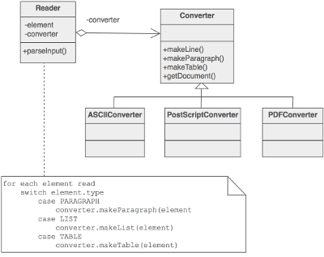
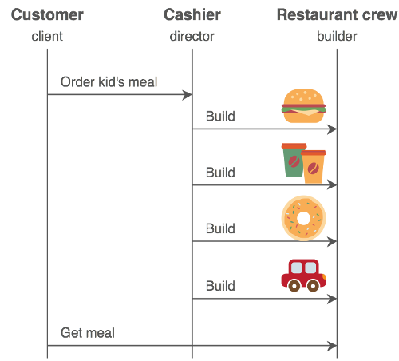

## Builder ##

### Цел ###

- Да се отдели създаването на сложен обект от неговото представяне (данни), така че същия процес по създаване да произвежда различни обекти
- Чрез логическо разделяне да се създава един от няколко възможни обекта

### Проблем ###

Приложение се опитва да създаде елементите на сложен агрегат. Спецификациите на агрегата съществуват записани и една от многото му компоненти се избира и създава

### Описание ###

Отделяне на алгоритъма за интерпретиране (четене и парсване) на съхранени данни (напритем RTF файлове) от алгоритъма за създаване и представяне на един от многото производни продукти (примерно ASCII, TeX). Това, което разграничава този метод е създаването на сложни агрегати.

Този модел се използва, когато се нуждаеш от много неща, за да направиш даден обект и когато редът на взимането им има значение. Извикват се услугите на “builder”-a, който създава част от комплексния обект всеки път, когато е извикан и поддържа всички междинни състояния.

По този начин се подсигурява фин контрол върху процеса на създаване на сложни обекти. За разлика от моделите, който създават обекти от веднъж, builder моделът създава обектите стъпка по стъпка под контрола на „director”.

### Чек лист ###

1. Решете дали един инпут с много възможни резултати е това, което трябва да се направи
2. Енкапсулирайте парсването на единния инпут в Reader клас
3. Създайте стандартен протокол за създаването на всички възможни обекти. Опишете стъпките на този портокол в Builder интерфейс
4. Дефинирайте класове, от Builder интерфейса за всеки от желаните обекти
5. Клиентът създава Reader обект и Builder обект
6. Клиентът подава заявка на Reader обекта да създаде, а той препраща заявката към Builder-а, който връща резултата

### Диаграма ###

### Пример ###

