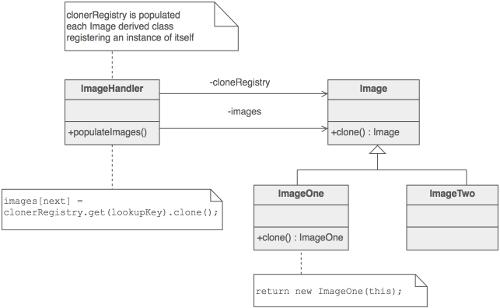

## Prototype ##

### Цел ###

- Определяне на типовете обекти, които да бъдат създавани чрез прототипна инстанция и създаването на нови обекти чрез копиране на този прототип
- Една иснтанция на клас се използва за да се копира във всички бъдещи инстанции
- Избягва се new оператора

### Описание ###

Декларира се абстрактен базов клас, който специфицира чист виртуален метод за клониране „clone” и поддържа речник на всички клонирани конкретни производни класове. Всеки клас който има нужда от полиморфен конструктор – който се извежда от абстрактен базов клаас и регистрира своята прототипна инстанция, имплементира clone() методът.

След това клиентът вместо да извиква new операторът на определен клас, извиква clone методът на абстрактният базов клас, подавайки му стринг или енумерация, която показва конкретния желан клас, който да бъде получен.

### Структура ###

Factory-то знае как да намери правилния прототип, а всеки продукт знае как да създава свои инстанции

### Чек лист ###

1. Добавяне на clone() метод към съществуваща „продуктова“ категория
2. Създаване на регистър, който да поддържа кеш оф прототипни обекти. Регистъра може да е енкапсулиран в нов Factory клас или да стои в базовия клас на „продуктовата“ категория
3. Създаване на factory метод, който може (или не) да приема аргументи, да намира правилния прототипен обект и да извиква clone() на този обект и да връща резултата
	1. Клиента замества всички използвания на new операторва с използване на factory методът

### Диаграма ###

