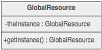

## Singleton ##

### Цел ###

- Да осигури клас, който има единствена инстанция и да даде глобален достъп до тази инстанция
- Инстанцията да се инициализира само когато е нужна

### Проблем ###

Приложението на този модел изисква единствена инстанция на обекта, комбинирана с „мързеливо“ инициализиране и глобален достъп до инстанцията

### Описание ###

Класът трябва да е отговорен за създаването и инициализирането и да ограничава достъпът. Инстанцията трябва да е декларирана като статична и вътрешна за класа. Допълнително се добавя публичена статична функция, която енкапсулира инициализиращият код и дава достъп до самата инстанция. 

Клиента достъпва фунцкията чрез името на класа, когато има нужда от използването на инстанцията му.

Този модел на дизайн на класове трябва да се използва само когато и трите следващи критерии са покрити:

1. Не може по разумен начин да се определи кой е „собственик“ на уникалната инстанция, т.е тя е нужна на повече от едно място 
2. Инициализацията се извършва при нужда от конкретната функционалнот и не преди това
3. Глобалния достъп до класа не съществува

Ако някой от тези критерии не е изпълнен, то може да се използва дизайн различен от сингълтън

### Чек лист ###

1. Дефинирайте private static полев класа, който трябва да има единствена инстанция
2. Дефинирайте public static функция, която да дава достъп до класа
3. Използвайте "lazy initialization" (създаване при първата употреба) във функцията, осигуряваща достъп
4. Дефинирайте всички конструктори като protected или private.
5. Клиентите могат да могат да манипулират сингълтъна само през функцията за достъп

### Диаграма ###

