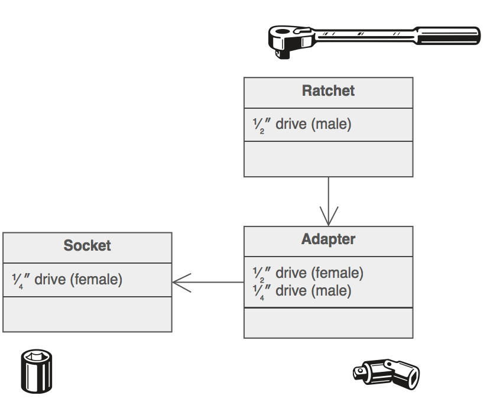

## Adapter Design Pattern ##

### Цел ###

- Конвертира интервейсът на един клас в друг интерфейс, който да е годен за употреба от клиентът. Адаптера прави възможно класовете да работят един с друг, въпреки, че по принцип не могат да работят заедно, заради несъвместими интерфейси
- Обвива съществуващ клас с нов интерфейс

### Проблем ###

Компонент който предлага функционалност, която бихте искали да преизползвате, но без да е съвместим с архитектурата на системата, която в момента разработвате

### Описание ###

Преизползването винаги е било трудно и една от причините е, че често трябва да се създаде нещо ново и същевременно да се преизползва нещо старо. В тези случаи често има нещо, което пречи на новият и старият компонент да работят заедно.

Адаптерът създава междинна абстракция, която превежда стария компонент към системите на новия. Клиентът извиква методите на адаптера, които ги превеждат към извиквания на методи на стария компонент. Тази стратегия може да бъде постигната с наследяване или агрегация.

Адаптера функционира като обвивка на съществуващ клас. Той дава различен, преведен към конкретните изисквания клас.

### Чек лист ###

1. Идентифицирайте клиента и компонентите, които трябва да се адаптират към него, за да може да работят заедно
2. Идентифицирайте интерфейсът, от който се нуждае клиентът
2. Създайте "wrapper" клас, който да направи възможно работата на клиента с несъвместимите компоненти
3. Клиентът се свързва към новия интерфейс

### Диаграма ###

### Пример ###

