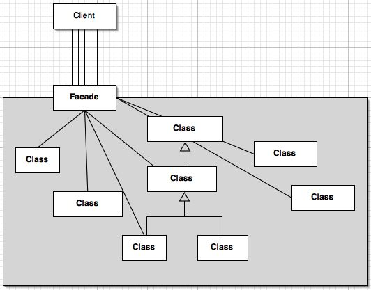

## Facade Design Pattern ##

### Цел ###

- Да даде един интерфейс към няколко други интерфейса в една подсистема. Фасадата представлява интерфейс на по-високо ниво, който прави работата с подсистемата по-лесна
- Да обвие сложна подсистема с по-прост интерфейс

### Проблем ###

Клиентите често се нуждаят от опростен интерфейс (фасада) към функционалностите в сложна подсистема

### Описание ###

Фасадата енкапсулира сложната подсистема в рамките на единствен интерфейс. Това намаля времето, нужно да се научи как точно се работи със подсистемата (защото фасадата е опростена, а сложната логика е зад нея). Освен това фасадата намалява coupling-а между подсистемата и клиентите. От друга страна фасадата е единствения начин да се достъпи подсистемата, т.е ограничава гъвкавостта, която оригиналната логика може да даде на потребители, които могат да разберат добре сложната логика

Фасадата трябва да е доста опростена и да улеснява клиента. Тя не трябва да се превръща във всезнаещ обект, който може всичко

### Чек лист ###

1. Измислете по-прост, унифициран интерфейс за подсистемата или компонентът
2. Създайте клас, който да обвива и енкапсулира подсистемата
3. Тази фасата (обвивка) трябва да обхваща сложността на взаимодействията на компонентите зад нея и да ги делегира на съответните нейни методи
4. Клиентът използва само фасадата
5. Понякога наличието на повече от една фасада може да бъде полезно

### Диаграма ###

