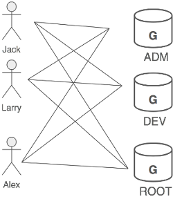
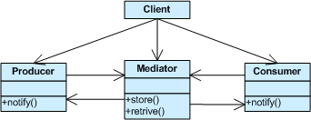

## Mediator Design Pattern ##

### Цел ###

- Да се дефинира обект, който енкапсулира как група обекти си взаимодейства. Чрез медиатора се постига свободен coupling тъй като обектите не взаимодействат пряко един с друг
- Да се създаде посредник, който да "разкачи" много на брой обекти

### Проблем ###

Искаме на създадем преизползваеми компоненти, но зависимостите между потенциално преизползваемите парчета приличат на феномена "спагети код"

### Описание ###

В Unix, позволението да се достъпват системни ресурси се управлява на три нива - world (свят), group (група) и owner (собственик). Групата е колекция от потребители свързани с функционална връзка. Всеки потребител, регистриран на системата може да бъде член на една или повече групи и всяка група може да има нула или повече потребители в себе си. Следващата фигура показва три потребителя, които са членове на трите различни групи:

### Пример за Медиатор ###

Ако трябва да моделираме това в софтуер, може да решим да имаме user обекти, вързани към group обекти и group обекти, свързани с user обекти. Но ако се наложат промени, и двата класа и всички техни инстанции ще бъдат засегнати.

Алтернативен подход би бил да се въведе абстракция, в която да се запише мапването на потребители в групи и групи в потребители. Това предлага няколко предимства: потребителите и групите не са свързани едни с други, връзките между тях могат да се манипулират и поддържат едновременно. Освен това абстракцията може да се разшири в бъдеще.

Разделянето на една система в много обекти като цяло засилва възможността за преизползване на код, но разпространяването на взаимовръзките между тези обекти на практика намаля възможността за преизползване. Обекта-медиатор енкапсулира всички връзки и играе ролята на център за комуникация. Отговаря за контрола и координацията на взаимовръзките на неговите клиенти и въвежда слаба свързаност между обектите, които не се обръщат един към друг директно.

### Чек лист ###

1. Идентифицирайте колекция от взаимодействащи си обекти, които ще спечелят от това да се развържат един от друг
2. Енкапсулирайте взаимодействиеята в абстракция на един нов клас
3. Създайте инстанция на този клас и преработете обектите така, че да взаимодействат само с този медиатор
4. Балансирайте принципна на decoupling (разкачане) с принципна на равномерно разпределяне на отговорностите
5. Внимавайте да не създадете контролер или богоподобен обект

### Диаграма ###

### Пример ###

