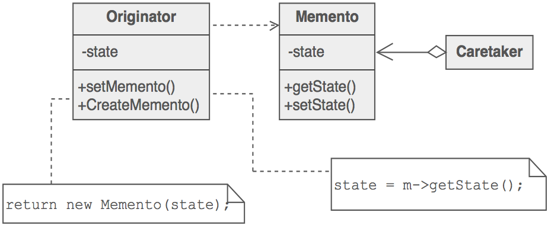

## Memento Design Pattern ##

### Цел ###

- Без да се нарушава енкапсулацията, да се запише вътрешното състояние на обект така, че този обект да може да се възстанови към това състояние на по-късен етап
- Магическа бисквитка, която енкапсулира "чек пойнт" възможност
- Възможност за undo или връщане към пълния статус на обекта

### Проблем ###

При нужда да се възстанови обект обратно към състояние в което е бил (т.е да се направи undo или rollback операция)

### Описание ###

Клиентът изисква Мементо от обекта, когато трябва да съхрани чекпойнт за състоянието на обекта. Съответно обекта инициализира мементо, характеризиращо моментното му състояние. Клиента съхранява мементото, но само обектът-източник може да съхранява и възстановява информация от мементото. Т.е ако клиента трябва да направи undo или rollback към предходно състояние на обекта, то той подава мементото обратно на обекта

За да се реазизира мементо дизайнът, трябва да се обособят 3 разлчни роли:

1. Originator - обектът, който знае как да се съхранява
2. Caretaker - обектът, който знае защо и кога Originator-а се нуждае да се съхране и да се възстанови
3. Memento - "кутията" в която се съхранява състоянието на Originator-а, за която се грижи Caretaker-а
 
### Чек лист ###

1. Идентефицирай ролите на “caretaker” и “originator”
2. Създай memento клас и го свържи с originator
2. Caretaker-а знае кога да създаде "check point" на originator-a
3. Originator-а създава мементо и копита своето състояние в това мементо
4. Caretaker-а съхранява мементото (но не може да наднича в него)
5. Caretaker-а знае кога да възстанови състоянието на originator-а 
6. Originator-а се самовъзстановява като използва информацията, съхранена във мементото

### Диаграма ###

