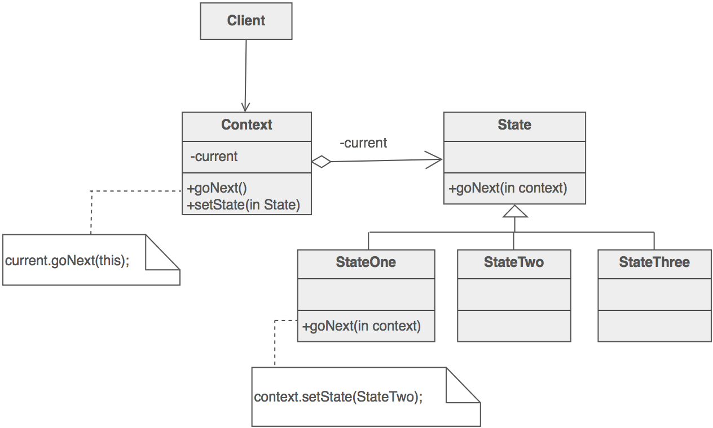

## State Design Pattern ##

### Цел ###

- Да позволи на обекта да променя своето поведение, когато вътрешното му състояние се промени
- Да се постигне обектно ориентирана статус машина

### Проблем ###

Начинът по който се държи един монилитен обект е функция на неговоро състояние и съответно трябва да се променя докато програмата работи в зависимост от състоянието на обекта

### Описание ###

State дизайна е решение на проблема как да се променя поведението на база на състоянието на обекта

- Дефинира се контекстен клас, който представя единствен интерфейс към външния свят
- Дефинира се абстрактен state базов клас
- Различните състояния на машината се представят като наследници на базовия state клас
- Дефинират се действия, специфични за всяко различно състояние
- Пази се показалец към текущото състояние в контекстния клас
- За да се промени текущото състояние се променя показалеца за състоянието 

### Структура ###

Интерфейсът на машината с различни състояние се енкапсулира в обвиващ клас. Йерархията на това, което е обвито в него е огледално на интерфейса на обвиващия клас с изключение на един допълнителен параметър. Този параметър позволява на обвитите класове да извикват обвивката си, когато е необходимо. 

### Чек лист ###

1. Идентефицирайте или създайте нов клас, който ще е машина със състояния (state machine) от гледна точка на клиента. Този клас е обвиващия клас
2. Създайте базов клас за състоянията, който имплементира интерфейсът на state machine класа. Всеки метод трябва да взима допълнителен параметър - инстанция на обвиващия клас. Базовият клас специфицира какво е състоянието по подразбиране
3. Създайте отделни класове за всяко отделно състояние. Тези класове презаписват само методите, които е нужно да бъдат презаписани
4. Класът обвивка поддържа обект в текущо състояние
5. Всяка заявка към обвиващия клас се пренасочва към текущото състояние на обекта
6. Методите на state класът променят текущото състояние, когато това е нужно

### Диаграма ###

