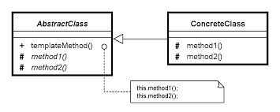

## Template Method Design Pattern ##

### Цел ###

- Определяне на скелета на алготиръм, като се отлагат някои от стъпките за клиентските подкласове. Темплейт методт позволява на класовете да редефинират определени стъпки на алгоритъма без да променят неговата структура
- Базовия клас определя основите на алгоритъма, а наследяващите класове имплементират детайлите

### Проблем ###

Два различни компонента имат значими прилики, но не демонстрират никакво преизползване на общи интерфейси или код. Ако се наложи промяна в двата компонента то се налага двойно усилие, за да се имплементира промяната

### Описание ###

Дизайнерът на компонентите решава кои стъпки на алгоритъма са стандартни и кои могат да бъдат променяни. Стандартните стъпки се имплементират в абстрактен базов клас, докато тези, които могат да се променят или получават имплементация по подразбиране или изобщо не се имплементират. Те трябва да бъдат написани в конкретните класове, наследници на абстрактния базов клас

Дизайнера определя задължителните стъпки от алгоритъма и тяхната подредба, но позволява клиента да разширява или презаписва някои от тези стъпки

Темплейт метъдът се използва често в различните frameworks. Всеки framework импелентира стандартните парчета от архитектурата и дефинира основите на всички необходими променяеми парчета. Това се нарича Холивуд принципът - "не ни се обаждай, ние ще ти се обадим".

### Чек лист ###

1. Проверете алгоритъма и решете кои стъпки са стандартни и кои могат да бъдат модифицирани в различните класове наследници
2. Дефинирайте нов абстрактен базов клас който да съдържа "не ни се обаждайте, ние ще ви се обадим" кодът
3. Преместете основата на алгоритъма (темплейтът) и дефиницията на всички стандартни стъпки в новия базов клас
4. Определете как ще се казват методите, които трябва да бъдат презаписани от наследниците. Те могат да имат имплементация по подразбиране (да бъдат абстрактни) или да са virtual методи
5. Всеки от съществуващите класове трябва да е във "е като" връзка спрямо новия абстрактен базов клас 
6. Премахнете от съществуващите класове кодът, който е преместен в базовия клас
7. Единствените детайли, които трябва да останат в класовете да тези, които са специфички за всеки от тях

### Диаграма ###

